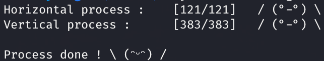
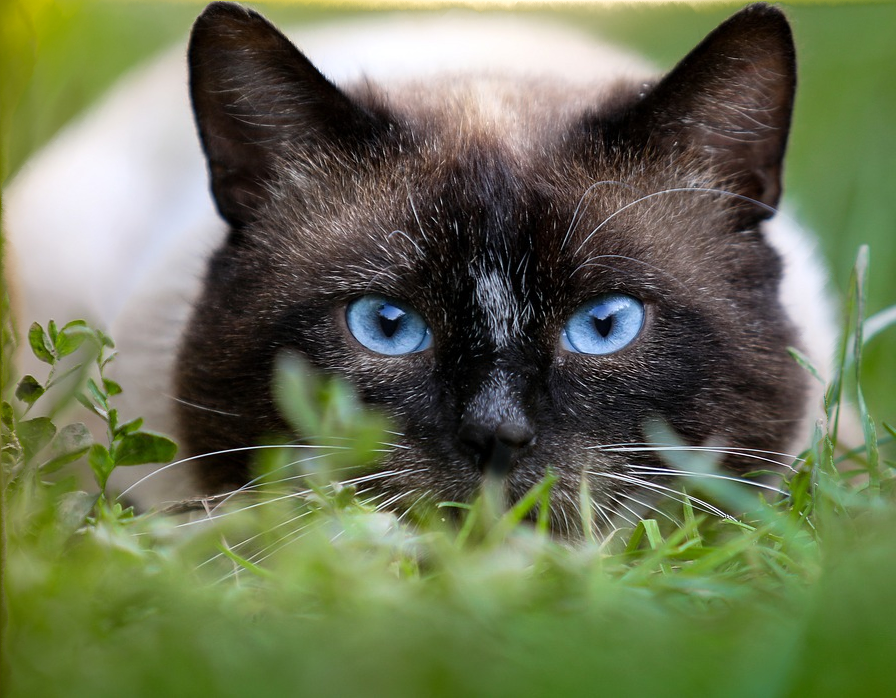
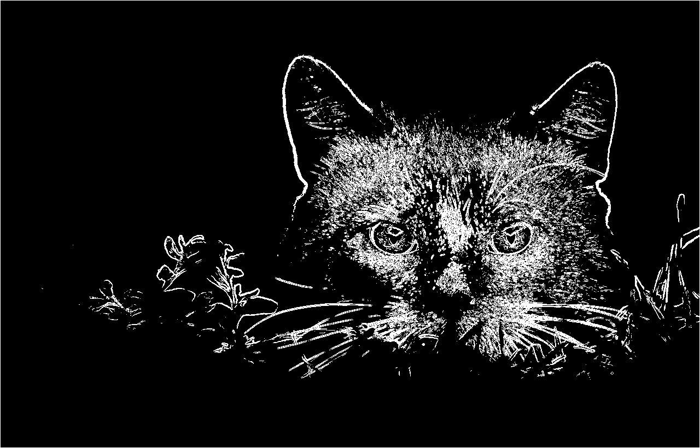
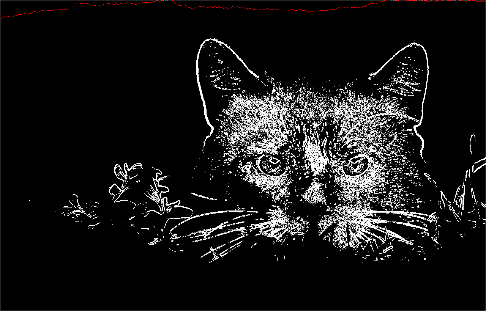
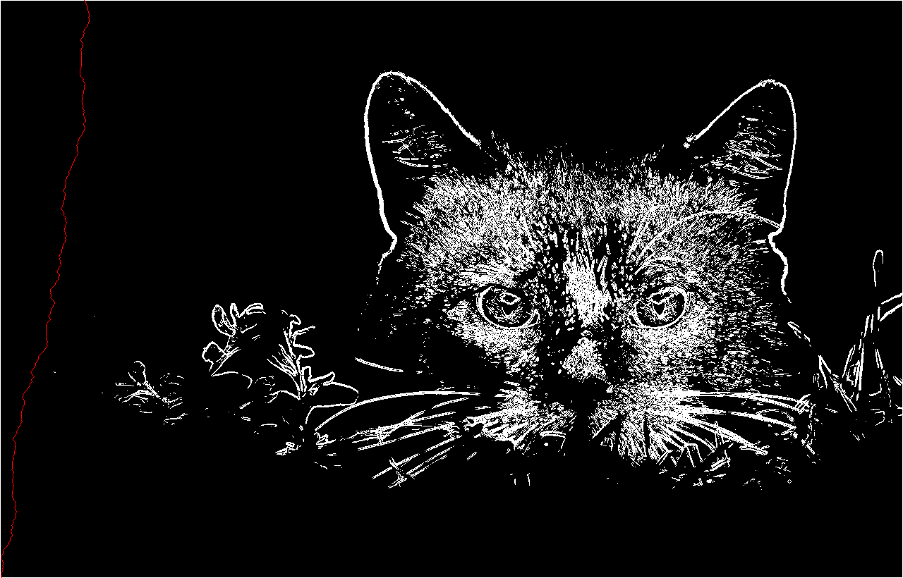

**Monnot Vincent**
**Delatte Laurent**
# Rapport 

## <u>Exercice 1</u>
*Compilation et execution du programme*  
`javac Coccinelle.java`  
`java Coccinelle`

### Réponses aux questions
1. La coccinelle a mangé 279 pucerons.
2. Elle a suivi le chemin (0,3)(1,2)(2,2)(3,1)(4,0)(5,0)(6,1)(7,0)
Case d’atterrisage = (0,3).
Case de l’interview = (7,0).

### Expplications du programme
On va tout d'abord créer un autre tableau avec le même nombre de lignes et de colonnes que celui donné dans l'énoncé. Pour cela on a créé la méthode tri qui prend en entrée, 2 tableau. Ici nos 2 tableaux sont le tableau donné par l'énoncé(tab) et le tableau créé/copié(tabtri). On va ensuite copier les valeurs comprises de tab dans tabtri, puis on pourra ensuite trier tabtri. On définit une variable permettant de stocker la localisation de la case qui entre celles qui l'encadre à la plus grande valeur. Une fois cette variable trouvé on ajoute cette valeur à la valeur présente des cases à la ligne suivante (le tout dans tabtri). Une fois fait pour la première ligne on change de ligne et etc... Enfin on obtient notre tableau trié avec à la fin nos valeurs les plus grandes (représentant l'importance ou non du trajet: plus le nombre est élevé et plus le chemin est rentable pour la coccinelle) et l'on pourra en déduire laquelle est maximum pour ensuite retrouver le chemin.

Cela va être le rôle de la méthode Parcours qui va comme son nom l'indique retrouver le parcours le plus rentable pour la coccinelle grâce au tableau trié. Cette méthode prendra entrée une liste vide qui stockera les différentes localisations des cases du chemin parcouru par la coccinelle, le tableau trié et la position de la dernière feuille ou la coccinelle doit se trouver. À chaque fois le programme va regarder dans le tableau trier la valeur des cases précédente et va choisir celle ayant la plus grosse valeur. Il renverra la position de cette case qui sera stocké dans la liste et elle se rappellera par elle-même avec des nouvelles valeur pour la position de la case et cela jusqu'à la fin. À la fin on aura donc notre liste avec les différentes positions des cases empruntés par la coccinelle, ainsi que le point de départ et le point d'arrivée.

## <u>Exercice 2</u>
*Compilation et execution du programme*  
`javac SeamCarving.java`  
`java SeamCarving [File] [Horizontal %] [Vertical %]`

### Exemple de sortie :  

## Exemples de redimensionnement :

Image d'origine:  

Image redimensionné [cat_resized_15_30.png]:  

Visualisation de l'énergie:  

Visualisation d'une *ligne* horizontale:  

Visualisation d'une *ligne* verticale:  
